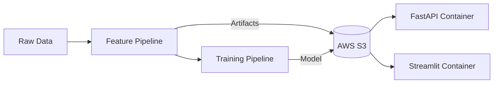

# 🏡 Housing Regression MLOps

Housing Regression MLE is an end-to-end machine learning pipeline for predicting housing prices using XGBoost. This project demonstrates strict ML Engineering best practices, including modular pipelines, experiment tracking via MLflow, containerization, AWS cloud deployment, and comprehensive testing.

The system features a FastAPI backend for inference and a Streamlit dashboard for interactive visualization.

## 🏗️ Architecture

The codebase is organized into distinct pipelines following the data lifecycle:
Load → Clean → Transform → Train → Tune → Evaluate → Inference → Serve



## Core Modules

| Module | Description |
| :--- | :--- |
| `src/feature_pipeline/` | Data loading, cleaning, and feature engineering (Time-aware splitting). |
| `src/training_pipeline/` | XGBoost training, Optuna tuning, and Evaluation (Quality Gate). |
| `src/inference_pipeline/` | Production inference logic using saved artifacts to prevent skew. |
| `src/api/` | FastAPI microservice with versioned endpoints (`/api/v1/predict`). |
| `src/app/` | Streamlit frontend for interactive predictions and trend analysis. |

## 🚀 Quick Start

### 1. Prerequisites
- Python 3.11+
- Docker (optional, for local container run)
- AWS Credentials (if accessing S3 artifacts)

### 2. Installation
We use `uv` for fast dependency management, but standard pip works too.

```bash
# Using pip
pip install -r requirements.txt

# Using uv
uv sync
```

### 3. Running Locally

Run the API:
```bash
uvicorn src.api.main:app --reload --port 8000
```
Swagger Docs: [http://localhost:8000/docs](http://localhost:8000/docs)

Run the Dashboard:
```bash
streamlit run src/app/ui.py
```
UI: [http://localhost:8501](http://localhost:8501)

## ☁️ Cloud Infrastructure

The project is deployed using a Serverless Container architecture on AWS.

- **Compute**: Amazon ECS (Fargate)
- **Storage**: Amazon S3 (`my-house-price-bucket-ml-project`)
- **Registry**: Amazon ECR (Private)
- **CI/CD**: GitHub Actions

### Services
- **Backend API**: `housing-api-service` (Port 8000)
- **Frontend UI**: `housing-ui-service` (Port 8501)

> [!NOTE]
> To save costs, ECS tasks are set to `desired_count: 0` by default. Scale up to 1 in the AWS Console to launch the application.

## 🛠️ Pipelines & Commands

### Data Pipeline
Runs ETL, cleans data, and generates artifacts (`imputer.json`, `freq_map.pkl`).
```bash
python src/feature_pipeline/load.py
python src/feature_pipeline/clean.py
python src/feature_pipeline/transform.py
```

### Training Pipeline
Trains the model, tunes hyperparameters, and evaluates against a holdout set.

```bash
# 1. Train Champion Model
python src/training_pipeline/train.py

# 2. Verify Quality (R2 > 0.80)
python src/training_pipeline/eval.py
```

### Cloud Sync
Uploads local models and artifacts to S3 for the API to consume.
```bash
python src/utils/upload_to_s3.py
```

## 🧪 Testing
We use `pytest` with mocking to ensure logic correctness without touching production infrastructure.

```bash
# Run all tests (Smoke + Logic)
pytest

# Run specific suite
pytest tests/test_smoke.py
```

## 🔑 Key Design Patterns

- **Training-Serving Skew Prevention**: Transformation logic (Imputers, Encoders) is saved as artifacts during training and reloaded during inference.
- **Context Enrichment**: The API accepts minimal input (zipcode, price) and enriches it with census data (Median Age, Income) looked up from a reference dataset.
- **Pull-on-Startup**: Containers are stateless; they download the latest model from S3 upon startup, decoupling deployment from model retraining.